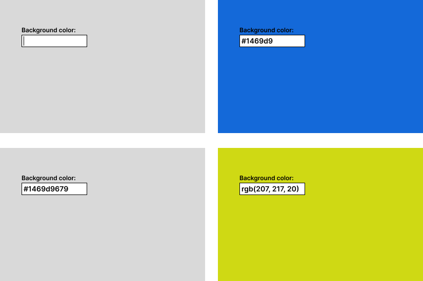

## Background Picker

Das Ziel dieser Aufgabe ist es, ein kleines Color-Picker UI zu erstellen.
Dieses UI besteht aus 2 Hauptelementen, einen Input-Feld und einen Hintergrund.
Sobald in das Feld eine gültige Farbe eingegeben wird, soll das Hintergrund der Seite zur eingegebener Farbe wechseln.\
\
Die Farbe soll entweder als RGB-Wert (`rgb(255, 255, 255)`) oder als Hex-Wert (`#FFFFFF`) eingegeben werden.
Falls das Feld leer ist, oder die Farbe ungültig, soll das Hintergrund als Standard weiss sein.

****

**Diese Aufgabe ist etwas anders als die übrigen aufgebaut. Um die Applikation zu starten, gib im Terminal `npm run start:03` (im `TS-Aufgaben/` Ordner) ein. Dieser Befehl startet einen lokalen Server. Danach kannst du die Applikation öffnen, in dem du in deinem Browser `http://localhost:8080` eingibst.**\
> **Wichtig**: Befor du die Tests für diese Aufgabe ausführst musst du zuerst sicherstellen, dass der lokale server gestartet ist.

****

### Beispielkonzept: 

